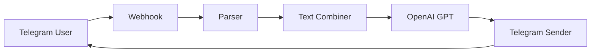

# Telegram Bot Setup with GPT Integration

## Architecture

This bot integrates Telegram with OpenAI GPT to process messages and generate automated responses. The data flow follows these steps:

1. Telegram Webhook receives messages
2. Parser extracts relevant data
3. Combiner prepares text for OpenAI
4. GPT processes and generates response
5. Sender returns response to user



## Prerequisites

- Telegram account
- OpenAI API key
- HTTPS server for Webhook
- Ngrok installed

## Step by Step Guide

### 1. Configure Ngrok

1. Download and install Ngrok from [https://ngrok.com/download](https://ngrok.com/download)
2. Create Ngrok account
3. Copy authentication token from dashboard
4. Configure token:

```bash
ngrok config add-authtoken your_ngrok_token
```

5. Start HTTPS tunnel:

```bash
ngrok http 7860
```

6. Copy generated HTTPS URL (example: https://abc123.ngrok.io)

### 2. Get OpenAI API Key

1. Visit [OpenAI Platform](https://platform.openai.com)
2. Login or create account
3. Go to [API Keys](https://platform.openai.com/api-keys)
4. Click "Create new secret key"
5. Copy and save generated key (shown only once)
6. Set up payment method in [Billing](https://platform.openai.com/account/billing/overview)

### 3. Create Telegram Bot

1. Open Telegram and search "@BotFather"
2. Type `/newbot`
3. Follow instructions to name your bot
4. Save provided API token

### 4. Configure Webhook

1. Use Ngrok URL to set up Webhook:

```bash
curl -F "url=https://your-ngrok-url.io/webhook" \
     https://api.telegram.org/bot<YOUR_TOKEN>/setWebhook
```

### 5. Implement Backend

1. Configure environment variables:

```bash
TELEGRAM_TOKEN=your_telegram_token
OPENAI_API_KEY=your_openai_key
PORT=7860  # Same port configured in Ngrok
```

2. Install required dependencies
3. Configure Webhook endpoint
4. Implement processing functions:
   - Telegram message parser
   - Text combiner for GPT
   - OpenAI integration
   - Response sender

### 6. Testing

1. Ensure Ngrok is running
2. Start server on port 7860
3. Send message to your bot
4. Check server logs
5. Confirm response in Telegram

## Project Structure

```
├── src/
│   ├── webhook/
│   ├── parser/
│   ├── combiner/
│   ├── gpt/
│   └── sender/
├── config/
├── .env
└── README.md
```

## Security Notes

- Never share API tokens
- Use HTTPS for all communications
- Implement rate limiting
- Validate all user inputs
- Monitor OpenAI API costs
- Update Webhook URL after Ngrok restarts

## Troubleshooting

- If Webhook fails, verify Ngrok URL is current
- Ensure server runs on same port as Ngrok
- Check Ngrok logs for connection issues
